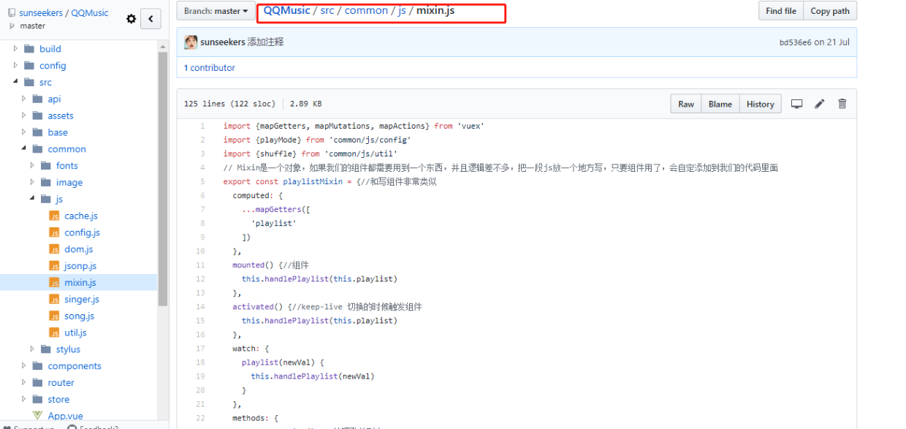
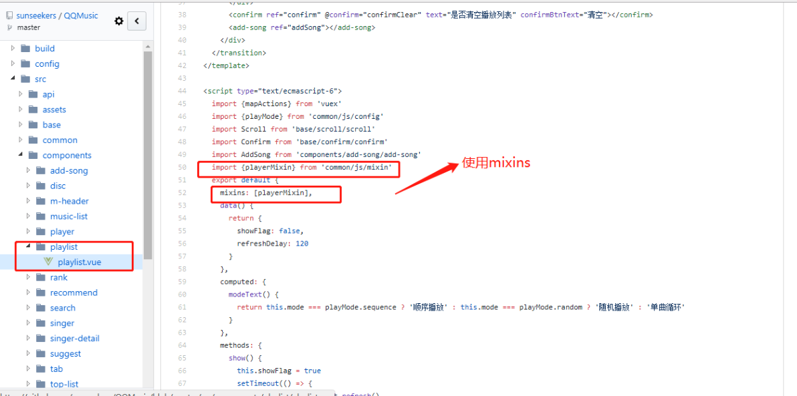

## vue项目实战中的小技巧

##### 1. 在注册，提交订单，新增按钮请求接口，为了防止用户的重复提交我们前端可以进行简单处理(函数节流或者标志位开关)
//函数节流，当一个函数被反复调用的时候，他只会执行一次，函数柯里化，调用一个函数，返回另一个函数

```
export function debounce(func,delay) {
  let timer
  return function (...args) {
    if (timer) {
      clearTimeout(timer)
    }
    timer = setTimeout(()=>{
      func.apply(this,args)
    },delay)
  }
}
```

<!--more-->

##### 2. 我们在子组件里面定义了一个方法，在父组件的兄弟元素中调用，使他改变子组件里面某些性质，或者传递数据(ps:可能描述有一点不对)，在父组件的兄弟元素里面调用子组件，好像有点意思，我们要怎么去实现呢？？

vue 中有一个 ref 特性，为了该组件赋予一个 ID 引用，可以通过引用可以获取到子组件里面的内容,但是我们要注意 $refs 只会在组件渲染完成之后生效，并且他们不是响应式的，避免在模板或者计算属性中访问 $refs


在父组件中的兄弟元素中通过 `this.$refs.searchBox.setQuery(query)` 进行引用详细见 `search` 组件92行和 `search-box` 组件的33行

##### 3. 在我们请求接口的时候，最好进行边界条件处理(异常处理)，避免因为接口导致页面无响应假死(player的322行)

```
getLyric() {//获取歌词格式化
  this.currentSong.getLyric().then((lyric) => {
    if (this.currentSong.lyric !== lyric) {
      return;
    }
    this.currentLyric = new Lyric(lyric, this.handleLyric);//当前歌曲的歌词.
    if (this.playing) {//当我们歌曲在播放的时候，才会有歌词.
      this.currentLyric.play();
    }
  }).catch(() => {//异常处理，清理
    this.currentLyric = null;
    this.playingLyric = '';
    this.currentLineNum = 0;
  })
}
```

异常处理，边界处理，我们前端应该要考虑，我们永远都不知道用户会怎么进行操作

##### 4. mapMutations 是对 mutations 做一层封装，在 methods，用扩展运算符，就可以做一个对象的映射，映射一个方法名


##### 5. vue 中，在 data，prop，computed 里面定义的数据会自动给她们添加一个 set和 get方法，用来实时监测数据的变化，然后响应到DOM 中，如果我们不需要监测变化，只是获取数据用来暂时保存，我们可以直接在方法中定义使用


##### 6. 在同一个组件里面如果有两个地方用到同样一段代码，我们可以抽象出来用一个公共的方法，如果是两个或者多个组件用到大量相同的一长段代码，我们可以用 mixin抽象出来（组件里面有的同名的方法会覆盖 mixin 里面的方法，因为组件里面的东西优先级更高）






#### 项目书写建议
##### 1. 我们的基础组件(子组件)中，没有任何逻辑处理，基础组件值负责派发事件，告诉父组件或者外部组件有个事件被触发了，以及告诉外部，他所知道的所有信息，所有的业务逻辑处理都在父组件进行，由外部触发事件

##### 2. 为了今后代码向后可扩展性，我们不在具体的方法中写入具体的数字,最好通过 const 常量来引入。我们在引入子组件的时候，最好子组件里面都是抽象的东西，通过父组件去传递 suggest 组件的40行

##### 3. 在 vue-cli 构建工具中，如果要上传空文件到 Github 上面需要一个 .gitkeep文件，否则空文件是不会上传到 github上面的

##### 4. 给 vuex定义数据的时候首先要想到我们需要什么数据，相关最底层数据=>state
`getter` 数据的映射，通常是一个函数，类似计算属性，可以根据 `state` 计算出一些属性，也可以是一些复杂的判断逻辑；

`mutation` 定义我们修改数据的逻辑，`mutation-types` 定义我们 `mutation` 需要哪些动作即函数名。

##### 5. 项目命名规范，可以让我们不经过大脑思考就知道这个文件是干什么的，这个函数有什么用。管理，尽可以的使得代码解耦性强，易于管理，易于查找，易于分享。变量命名语义化，可减少注释，清晰易懂

##### 6. 在 vue 的使用中，如果 data 中的键和 methods 对象中定义的函数名称相同，会有警告提示，因为会出现对象覆盖对象的情况，所以不允许出现这样的情况。优先级关系：props 优先级 > data 优先级 > methods 优先级

##### 7. 在 vue2.0以上的版本，最终渲染都是通过 render 函数，如果写的是template属性，则需要编译成 render 函数(生命周期图可以看出)


[尊重原创，感谢原创分享](https://juejin.im/post/5bbe88e85188255c3b7da9e0?utm_source=gold_browser_extension)